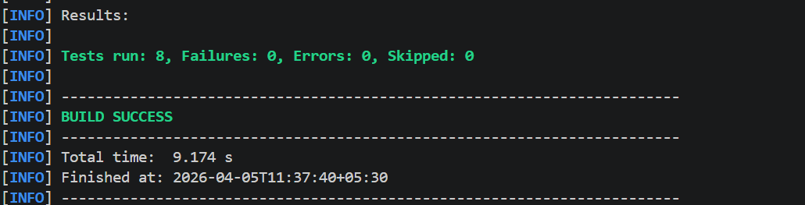

# WhatsApp Bot Backend Simulation


A Spring Boot 3.x Maven project that simulates a WhatsApp chatbot backend with validation, conversation state tracking, admin stats, Swagger docs, Docker support, and CI-ready tests.

## Features

- Webhook endpoint to receive chatbot messages
- Rule-based replies: hi, bye, help, history, and fallback
- Stateful conversation tracking with in-memory storage
- Name extraction from messages like "My name is John"
- Admin stats endpoint with token-based header guard
- Structured SLF4J logging for each incoming message
- Swagger UI via springdoc-openapi
- Global exception handling for 400/500 responses
- Dockerfile and docker-compose support
- JUnit 5 + Mockito + MockMvc tests

## Prerequisites

- Java 17+
- Maven 3.9+
- Docker and Docker Compose (optional)

## Run Locally

### With Maven

```bash
mvn spring-boot:run
```

### With Docker Compose

```bash
docker-compose up --build
```

The app runs at `http://localhost:8080`.

Swagger UI is available at `http://localhost:8080/swagger-ui.html`.

## API Reference

| Endpoint | Method | Description | Sample Request | Sample Response |
| --- | --- | --- | --- | --- |
| `/webhook` | POST | Receives incoming message and sends chatbot reply | `{ "from": "919999999999", "message": "Hi", "messageId": "abc123" }` | `{ "to": "919999999999", "reply": "Hello!", "status": "sent" }` |
| `/admin/stats` | GET | Returns total messages, users, top keywords, uptime, and last message time (requires `X-Admin-Token`) | Header: `X-Admin-Token: mysecrettoken` | `{ "totalMessages": 42, "uniqueUsers": 7, "topKeywords": ["hi","help","bye"], "serverUptime": "2h 15m", "lastMessageAt": "2024-01-15T10:30:00Z" }` |
| `/actuator/health` | GET | Health endpoint used by Docker healthcheck | N/A | `{ "status": "UP" }` |

## Screenshot Placeholder

Add screenshots here, for example:

- Swagger UI page
- Sample `/webhook` request/response in Postman
- Sample `/admin/stats` response

## Environment Variables

- `BOT_ADMIN_TOKEN` (default: `mysecrettoken`)

## Notes

- Conversation state and stats are in-memory and reset on application restart.
- For production, replace in-memory stores with a persistent database/cache.


